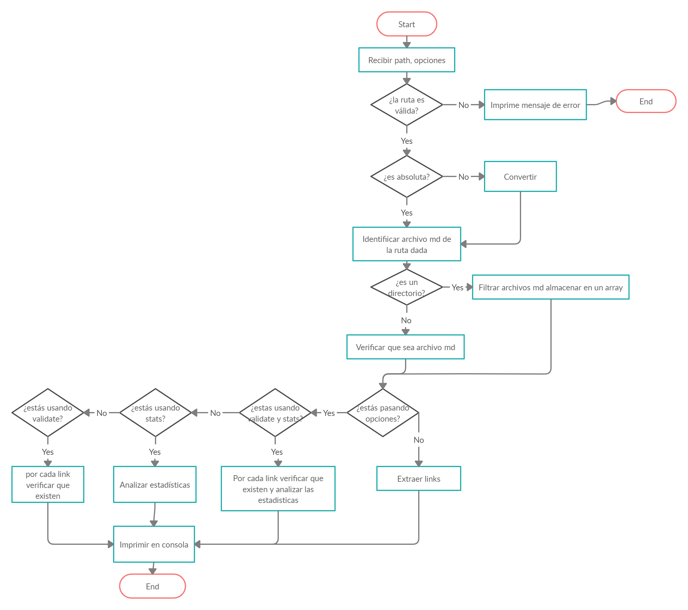

# Markdown Links

Librería que permite extraer los links de los archivos-md dentro de una ruta (archivo o directorio), y mostrar la ruta, href y texto de cada link.

## Introducción a Markdown

Markdown es un lenguaje de marcado ligero muy popular entre developers. Es usado en muchísimas plataformas que manejan texto plano (GitHub, foros, blogs, ...), y es muy común encontrar varios archivos en ese formato en cualquier tipo de repositorio (empezando por el tradicional `README.md`).

Estos archivos `Markdown` normalmente contienen _links_ (vínculos/ligas) que muchas veces están rotos o ya no son válidos y eso perjudica mucho el valor de la información que se quiere compartir.

Dentro de una comunidad de código abierto, nos han propuesto crear una herramienta usando [Node.js](https://nodejs.org/), que lea y analice archivos en formato `Markdown`, para verificar los links que contengan y reportar algunas estadísticas.

## Versión
1.1.4

## Homepage

[GitHub Laura Jimenez B](https://github.com/LauraJimenezB/LIM013-fe-md-links)

## Diagrama de flujo

El siguiente diagrama de flujo representa el algoritmo que soluciona el problema, muestra las fases de implementación y los procesos que cada uno realiza.
 
### Diagrama de flujo del Proyecto MD Links


## Instalación

 Puede instalar la librería de la siguiente forma npm install
 ```
 npm install --g laurajimenez-md-links
 ```
 o de manera local para usar la Api 
 ```
 npm install --save laurajimenez-md-links
 ```

## Guía de uso
 ```
md-links <path> <options>
 ```
- `path` : es la ruta del directorio o archivo.
- `option` :
  - `--validate`: esta opción valida si el link funciona o no (status y mensaje).
  - `--stats`: esta opción muestra estadísticas de los links(links existentes y únicos)
Al combinar ambas opciones se mostrará la cantidad de links que existen, número de links rotos y  npumero de links únicos.
****


## CLI (Línea de comandos)
 ```
md-links <path> <options>
 ```
Si desea retornar las propiedades **href, text y file**, ejecute: 

```sh
$ md-links <path> 
./some/example.md http://algo.com/2/3/ Link a algo
./some/example.md https://otra-cosa.net/algun-doc.html algún doc
./some/example.md http://google.com/ Google
```


Si desea retornar las propiedades **file, href, text, code y status**, ejecute:

```sh
$ md-links <path> --validate
./some/example.md http://algo.com/2/3/ ok 200 Link a algo
./some/example.md https://otra-cosa.net/algun-doc.html fail 404 algún doc
./some/example.md http://google.com/ ok 301 Google
```


Si desea retornar las propiedades **total**(cantidad total de links) y **unique**(cantidad de links unicos), ejecute:

```sh
$ md-links <path> --stats
Total: 3
Unique: 3
```

Si desea retornar las propiedades **total**(cantidad total de links) y **unique**(cantidad de links unicos) y **broken** cantidad de links inactivos), ejecute:

```sh
$ md-links <path> --stats --validate
Total: 3
Unique: 3
Broken: 1
```

#### Autor
Laura Jimenez Bernales
****
